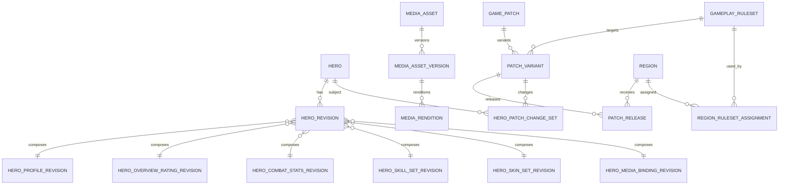

# WikiAOV Backend — Database dự án

**Database:** PostgreSQL  
**Migration:** Flyway  
**Phạm vi:** logical + implementation-oriented schema cho backend hiện hành.  
**Tài liệu liên quan:** `01-BAN-DAC-TA-DU-AN.md`, `03-API-DU-AN.md`

---

## 1. Nguyên tắc database

1. Database `wiki` riêng cho `wiki-service`, nhiều PostgreSQL schema theo domain ownership. Có thể chung PostgreSQL instance với service khác (Keycloak, `community-service`) nhưng không chung database và không chung user DB.
2. Entity/repository chỉ thuộc module sở hữu schema đó.
3. Cross-module ID ưu tiên **logical reference**; không tạo cross-schema FK nếu làm module bị coupling sai ownership.
4. Trong cùng module/schema, dùng FK, unique constraint và check constraint mạnh.
5. Published revisions immutable.
6. Draft có optimistic version và concurrency control.
7. Flyway là cơ chế duy nhất thay đổi schema ở môi trường dùng chung.
8. Hibernate không tự `update` schema ở production.
9. UUID là technical ID; `code` là stable readable identifier.
10. `TIMESTAMPTZ` cho thời gian; lưu UTC.

---

## 2. PostgreSQL schemas

```text
hero          Hero identity/revisions/skills/skins/change sets
media         Media asset/version/rendition/upload state
patch         Region/Locale/Ruleset/GamePatch/Variant/Release/index
item          Item catalog/revisions/change sets
arcana        Arcana catalog/revisions/change sets
spell         Spell/phụ trợ catalog/revisions/change sets
enchantment   Enchantment/phù hiệu catalog/revisions/change sets
gamemode      Game mode/system catalog revisions
access        Local identity mapping/audit support nếu cần
```

`query` module không cần schema riêng nếu read model được dựng động. Nếu sau này materialize projection, có thể tạo schema `projection`; dữ liệu ở đó rebuild được và không phải source of truth.

---

## 3. Shared value concepts

Không tạo `common_entity` table/library. Tuy nhiên các schema dùng chung convention:

### ID

```text
UUID
```

### Stable code

```text
VARCHAR(64/128)
```

quy tắc slug lowercase ASCII, unique theo domain.

### Actor

Các record audit/created-by có:

```text
created_by_issuer
created_by_subject
```

hoặc actor reference nội bộ nếu sau này có `access.user_account`, nhưng vẫn phải truy ra issuer + subject gốc.

### Revision lifecycle

Thông thường:

```text
DRAFT
PUBLISHED
DISCARDED
```

Published revision không chỉnh content nữa.

---

# PHẦN A — HERO SCHEMA

## 4. `hero.hero`

Stable identity của tướng.

| Column | Type | Rule |
|---|---|---|
| id | UUID | PK |
| code | VARCHAR(64) | NOT NULL UNIQUE, immutable sau public |
| created_at | TIMESTAMPTZ | NOT NULL |
| created_by_issuer | TEXT | NOT NULL |
| created_by_subject | TEXT | NOT NULL |

Không lưu name/stats/ảnh trực tiếp tại đây.

### External identity

`hero.hero_external_identity`

| Column | Type |
|---|---|
| hero_id | UUID |
| provider | VARCHAR(64) |
| namespace | VARCHAR(64) |
| external_value | VARCHAR(255) |

PK/unique phù hợp:

```text
UNIQUE(provider, namespace, external_value)
UNIQUE(hero_id, provider, namespace)
```

---

## 5. `hero.hero_revision`

Composition revision của hero.

| Column | Type | Ý nghĩa |
|---|---|---|
| id | UUID | PK |
| hero_id | UUID | FK hero.hero |
| ruleset_id | UUID | logical ref patch.gameplay_ruleset |
| revision_no | BIGINT | tăng trong `(hero_id,ruleset_id)` |
| state | VARCHAR(16) | DRAFT/PUBLISHED/DISCARDED |
| version | BIGINT | optimistic version của draft |
| publication_sequence | BIGINT NULL | tăng khi publish |
| published_at | TIMESTAMPTZ NULL | thời điểm WikiAOV publish revision |
| cause | VARCHAR(32) | GAME_PATCH / CONTENT_CORRECTION / TRANSLATION / IMPORT_CORRECTION / VISUAL_UPDATE / OTHER |
| source_revision_id | UUID NULL | revision được fork |
| effective_from_patch_variant_id | UUID NULL | logical ref patch.patch_variant |
| profile_revision_id | UUID | section ref |
| overview_rating_revision_id | UUID | section ref |
| combat_stats_revision_id | UUID | section ref |
| skills_revision_id | UUID | section ref |
| skins_revision_id | UUID | section ref |
| media_binding_revision_id | UUID | section ref |
| created_at | TIMESTAMPTZ | NOT NULL |
| updated_at | TIMESTAMPTZ | NOT NULL |
| created_by_issuer | TEXT | NOT NULL |
| created_by_subject | TEXT | NOT NULL |
| updated_by_issuer | TEXT | NOT NULL |
| updated_by_subject | TEXT | NOT NULL |

Constraints:

```text
UNIQUE(hero_id, ruleset_id, revision_no)
UNIQUE(hero_id, ruleset_id, publication_sequence) WHERE publication_sequence IS NOT NULL
```

Partial unique index:

```sql
CREATE UNIQUE INDEX uq_hero_one_draft_per_ruleset
ON hero.hero_revision(hero_id, ruleset_id)
WHERE state = 'DRAFT';
```

State check:

```text
PUBLISHED -> published_at/publication_sequence NOT NULL
DRAFT/DISCARDED -> publication_sequence NULL
```

### Resolution rule

Current revision cho `(hero, region, atTime)` không nhất thiết lưu bằng `hero_region.current_revision_id`.

Resolver:

1. resolve ruleset của region tại `atTime`;
2. resolve active PatchVariant của region/ruleset tại `atTime`;
3. chọn HeroRevision PUBLISHED:
   - cùng hero/ruleset;
   - `effective_from_patch_variant.ruleset_ordinal <= active ruleset ordinal`, hoặc effective-from null cho baseline;
   - `published_at <= atTime`;
4. lấy revision có gameplay applicability mới nhất, rồi publication sequence mới nhất trong applicability đó.

Content correction sau patch có thể trở thành current mà không tạo patch mới.

---

## 6. Profile section

### `hero.hero_profile_revision`

| Column | Type |
|---|---|
| id | UUID PK |
| hero_id | UUID FK |
| state | VARCHAR(16) |
| version | BIGINT |
| created_at | TIMESTAMPTZ |
| created_by_issuer | TEXT |
| created_by_subject | TEXT |

### `hero.hero_profile_role`

```text
profile_revision_id
role_code
```

PK `(profile_revision_id, role_code)`.

Role dictionary ban đầu:

```text
TANK
WARRIOR
ASSASSIN
MAGE
MARKSMAN
SUPPORT
```

Không khẳng định taxonomy này là duy nhất của game; nó là canonical dictionary của WikiAOV và phải map nguồn có provenance.

### `hero.hero_profile_translation`

| Column | Type |
|---|---|
| profile_revision_id | UUID |
| locale | VARCHAR(16) |
| name | VARCHAR(120) |
| title | VARCHAR(200) NULL |
| summary | TEXT NULL |
| lore | TEXT NULL |

PK `(profile_revision_id, locale)`.

Không tạo `name_vi`, `name_en` columns.

---

## 7. Overview ratings section

### `hero.hero_overview_rating_revision`

| Column | Type |
|---|---|
| id | UUID PK |
| hero_id | UUID |
| state | VARCHAR(16) |
| scale_code | VARCHAR(64) |
| survivability | NUMERIC NULL |
| attack_damage | NUMERIC NULL |
| skill_effects | NUMERIC NULL |
| difficulty | NUMERIC NULL |
| derived | BOOLEAN NOT NULL DEFAULT FALSE |
| created_at | TIMESTAMPTZ |

Nếu nguồn thật dùng scale 1..10 thì `scale_code` trỏ dictionary tương ứng. Nếu WikiAOV normalize từ thanh bar/ảnh, `derived=true` và provenance phải ghi nguồn/phương pháp.

### `hero.rating_scale`

```text
code PK
min_value
max_value
semantics
```

---

## 8. Combat stats section

### `hero.hero_combat_stats_revision`

```text
id UUID PK
hero_id UUID FK
state
created_at
...
```

### `hero.hero_combat_stat_value`

| Column | Type | Ghi chú |
|---|---|---|
| stats_revision_id | UUID | FK |
| stat_key | VARCHAR(64) | canonical key |
| base_value | NUMERIC NULL | |
| growth_per_level | NUMERIC NULL | |
| unit_code | VARCHAR(32) | HP/POINT/PERCENT/... |
| metadata | JSONB NULL | chỉ metadata mở, không thay canonical columns |

PK `(stats_revision_id, stat_key)`.

Canonical stat dictionary table tùy chọn:

`hero.combat_stat_definition`

```text
stat_key PK
unit_code
data_type
sort_order
```

---

## 9. Skill identities và skill set revision

### `hero.hero_skill`

Stable identity trong hero:

```text
hero_id UUID
skill_key VARCHAR(64)
created_at
```

PK `(hero_id, skill_key)`.

### `hero.hero_skill_set_revision`

```text
id UUID PK
hero_id UUID
state
version
created_at
...
```

### `hero.hero_skill_snapshot`

| Column | Type |
|---|---|
| skill_set_revision_id | UUID |
| hero_id | UUID |
| skill_key | VARCHAR(64) |
| kind | VARCHAR(16) |
| form_key | VARCHAR(64) NULL |
| display_order | INTEGER |
| icon_asset_id | UUID NULL | logical media ref |

PK `(skill_set_revision_id, skill_key)`.

Unique `(skill_set_revision_id, display_order)`.

`kind`:

```text
PASSIVE
ACTIVE
OTHER
```

### `hero.hero_skill_translation`

```text
skill_set_revision_id
skill_key
locale
name
description
```

PK `(skill_set_revision_id, skill_key, locale)`.

### Structured effects

`hero.hero_skill_effect`

```text
skill_set_revision_id
skill_key
effect_order
effect_type
metadata JSONB
```

Taxonomy:

```text
STUN
SLOW
KNOCK_UP
SILENCE
SHIELD
HEAL
IMMUNITY
DASH
TELEPORT
OTHER
```

### Numeric skill data

Không ép toàn bộ mechanic vào một bảng generic. Có thể lưu normalized common values (`cooldown`, `cost`, `damage series`) và giữ extension JSONB có schema/version nếu mechanic đặc biệt.

---

## 10. Skin identity và skin set revision

### `hero.hero_skin`

```text
hero_id
skin_key
created_at
```

PK `(hero_id, skin_key)`.

### `hero.hero_skin_set_revision`

```text
id UUID PK
hero_id
state
version
created_at
```

### `hero.hero_skin_snapshot`

```text
skin_set_revision_id
hero_id
skin_key
display_order
art_asset_id UUID NULL
rarity_code VARCHAR(64) NULL
```

### `hero.hero_skin_translation`

```text
skin_set_revision_id
skin_key
locale
name
description
acquisition_note
```

Giá/cách sở hữu có cấu trúc nên được model riêng khi nguồn và semantics được chốt; không nhét mọi thứ vào `acquisition_note` lâu dài.

---

## 11. Hero media binding revision

### `hero.hero_media_binding_revision`

```text
id UUID PK
hero_id UUID
state
version
created_at
```

### `hero.hero_media_binding`

| Column | Type |
|---|---|
| media_binding_revision_id | UUID |
| media_role | VARCHAR(32) |
| asset_id | UUID |

PK `(media_binding_revision_id, media_role)`.

Hero roles bắt buộc hiện tại:

```text
HEAD
PORTRAIT
SPLASH
```

`asset_id` là logical ref tới `media.media_asset`, không FK cross-schema bắt buộc.

Skill icon/skin art có binding nằm trong skill/skin snapshot vì owner semantic nằm ở Hero section đó.

---

## 12. Hero provenance/source

Nên có source refs ở section/change level.

Ví dụ bảng generic trong hero schema:

`hero.hero_source_reference`

```text
id
owner_type
owner_revision_id
position
label
source_url NULL
observed_at NULL
verification_state
note NULL
```

`owner_type` chỉ nhận enum nội bộ của Hero domain, không dùng generic toàn database.

---

## 13. Hero patch change

### `hero.hero_patch_change_set`

| Column | Type |
|---|---|
| id | UUID PK |
| patch_variant_id | UUID | logical ref |
| hero_id | UUID |
| from_hero_revision_id | UUID NULL |
| to_hero_revision_id | UUID |
| changed_sections | TEXT[] hoặc join table |
| created_at | TIMESTAMPTZ |
| created_by_* | TEXT |

Unique đề xuất:

```text
UNIQUE(patch_variant_id, hero_id)
```

nếu mỗi hero chỉ có một aggregated change set cho variant.

### Summary translations

`hero.hero_patch_change_translation`

```text
change_set_id
locale
summary
```

### Typed change items

Không buộc một JSON shape cho tất cả.

Có thể dùng các bảng:

```text
hero.hero_stat_change
hero.hero_skill_change
hero.hero_role_change
hero.hero_visual_change
hero.hero_mechanic_change
hero.hero_other_change
```

Ví dụ `hero_stat_change`:

```text
id
change_set_id
stat_key
old_value
new_value
unit_code
change_kind
sort_order
```

`change_kind`:

```text
BUFF
NERF
ADJUSTMENT
REWORK
FIX
OTHER
```

---

# PHẦN B — MEDIA SCHEMA

## 14. `media.media_asset`

Logical/semantic identity.

| Column | Type |
|---|---|
| id | UUID PK |
| semantic_type | VARCHAR(64) |
| lifecycle_state | VARCHAR(16) |
| current_version_id | UUID NULL |
| created_at | TIMESTAMPTZ |
| created_by_issuer | TEXT |
| created_by_subject | TEXT |

`semantic_type` ví dụ:

```text
HERO_HEAD
HERO_PORTRAIT
HERO_SPLASH
HERO_SKILL_ICON
HERO_SKIN_ART
ITEM_ICON
ARCANA_ICON
SPELL_ICON
ENCHANTMENT_ICON
PATCH_ART
OTHER
```

Semantic type không chứa owner ID.

---

## 15. `media.media_asset_version`

Source bytes version.

| Column | Type |
|---|---|
| id | UUID PK |
| asset_id | UUID FK media_asset |
| version_no | BIGINT |
| state | VARCHAR(16) |
| storage_alias | VARCHAR(64) |
| object_key | TEXT |
| object_version | TEXT NULL |
| sha256 | CHAR(64) |
| mime_type | VARCHAR(64) |
| width | INTEGER |
| height | INTEGER |
| size_bytes | BIGINT |
| activated_at | TIMESTAMPTZ NULL |
| supersedes_version_id | UUID NULL |
| created_at | TIMESTAMPTZ |
| created_by_* | TEXT |

Constraints:

```text
UNIQUE(asset_id, version_no)
UNIQUE(storage_alias, object_key, object_version) tùy provider
```

Không overwrite bytes của một version đã READY/ACTIVE.

### Khi tạo version mới

Cùng semantic artwork nhưng source tốt hơn:

```text
512px -> 4K
PNG source -> WebP source tốt hơn
```

### Khi tạo asset mới

Semantic artwork thực sự khác:

```text
new official portrait
meaningful crop/framing khác
```

---

## 16. `media.media_rendition`

Delivery derivative.

```text
id UUID PK
asset_version_id UUID FK
rendition_code VARCHAR(64)
object_key TEXT
mime_type
width
height
size_bytes
sha256
created_at
```

Ví dụ:

```text
ORIGINAL
THUMB_128_WEBP
CARD_512_WEBP
SPLASH_1920_AVIF
```

Resize/codec derivative không làm tăng MediaAssetVersion nếu source version không đổi.

---

## 17. Upload session

`media.media_upload_session`

```text
id UUID PK
asset_id UUID NULL
intended_semantic_type VARCHAR(64) NULL
object_key TEXT
state VARCHAR(16)
expected_mime_type VARCHAR(64) NULL
expires_at TIMESTAMPTZ
created_at
created_by_issuer
created_by_subject
completed_at NULL
error_code NULL
```

State:

```text
REQUESTED
UPLOADED
VALIDATING
READY
REJECTED
EXPIRED
```

Object upload xong chưa đồng nghĩa asset version READY.

---

## 18. Media provenance

`media.media_provenance`

```text
id
asset_id / asset_version_id
source_type
source_url NULL
source_label
observed_at NULL
note NULL
```

Không tự fetch arbitrary source URL trong normal read flow.

---

## 19. Media usage projection

`media.media_usage_index` là **projection**, không source of truth.

```text
asset_id
owner_domain
owner_type
owner_id
revision_id
property_role
usage_scope
updated_at
```

Ví dụ:

```text
A20 | HERO | HERO | nakroth-id | M5 | PORTRAIT | CURRENT
```

Scope:

```text
CURRENT
DRAFT
HISTORICAL
```

Projection rebuild bằng public reference query từ owner domain.

Không để Media module query trực tiếp toàn bộ internal hero/item tables như source of truth.

---

# PHẦN C — PATCH / REGION / RULESET

## 20. `patch.region`

```text
id UUID PK
code VARCHAR(16) UNIQUE
name_key / metadata
 timezone VARCHAR(64)
default_locale VARCHAR(16)
lifecycle_state VARCHAR(16)
```

`default_locale` chỉ là default; không khóa locale của caller.

---

## 21. `patch.locale`

Nếu muốn quản lý locale canonical trong DB:

```text
code VARCHAR(16) PK
language_code
fallback_locale NULL
lifecycle_state
```

Locale không chứa gameplay data.

---

## 22. `patch.gameplay_ruleset`

```text
id UUID PK
code VARCHAR(64) UNIQUE
description TEXT
lifecycle_state VARCHAR(16)
created_at
```

Ví dụ conceptual:

```text
AOV-GLOBAL
AOV-TW
AOV-TEST
```

---

## 23. `patch.region_ruleset_assignment`

```text
id UUID PK
region_id UUID FK
ruleset_id UUID FK
valid_from TIMESTAMPTZ
valid_to TIMESTAMPTZ NULL
```

Invariant:

> Một region tại một thời điểm chỉ resolve tới một primary ruleset trong scope mặc định.

Exclusion constraint/range constraint có thể dùng để ngăn overlapping assignments.

---

## 24. `patch.game_patch`

Canonical patch family.

```text
id UUID PK
code VARCHAR(64) UNIQUE
sequence BIGINT
status VARCHAR(16)
created_at
created_by_*
```

Status ví dụ:

```text
DRAFT
PUBLISHED
ARCHIVED
```

---

## 25. `patch.game_patch_translation`

```text
patch_id
locale
title
summary
description NULL
```

PK `(patch_id, locale)`.

---

## 26. `patch.patch_variant`

Ruleset-specific patch variant.

```text
id UUID PK
patch_id UUID FK
ruleset_id UUID FK
variant_code VARCHAR(64)
ruleset_ordinal BIGINT
status VARCHAR(16)
published_at TIMESTAMPTZ NULL
created_at
```

Constraints:

```text
UNIQUE(patch_id, ruleset_id)
UNIQUE(ruleset_id, ruleset_ordinal)
```

Nếu một patch family có nhiều variant cho cùng ruleset vì use case đặc biệt, thay unique bằng `(patch_id,ruleset_id,variant_code)`; mặc định một variant/ruleset là đủ.

---

## 27. `patch.patch_release`

Region rollout.

```text
id UUID PK
patch_variant_id UUID FK
region_id UUID FK
effective_at TIMESTAMPTZ
announced_at TIMESTAMPTZ NULL
status VARCHAR(16)
source_url TEXT NULL
created_at
```

Status:

```text
DRAFT
SCHEDULED
CANCELLED
```

“ACTIVE” có thể là trạng thái derived từ `status=SCHEDULED` và `effective_at <= now`; không bắt buộc update row đúng thời điểm để biết active.

Constraint:

```text
UNIQUE(patch_variant_id, region_id)
```

Validation application:

- variant ruleset phải phù hợp RegionRulesetAssignment tại `effective_at`;
- không schedule release mâu thuẫn timeline.

---

## 28. `patch.patch_change_index`

Read projection cho mixed-domain patch query.

```text
id UUID PK
patch_variant_id UUID
owner_domain VARCHAR(32)
subject_id UUID
subject_code VARCHAR(128)
change_set_id UUID
categories TEXT[]
change_kinds TEXT[]
change_count INTEGER
from_revision_id UUID NULL
to_revision_id UUID NULL
sort_order INTEGER
```

Không dùng làm detailed source-of-truth.

Rebuild từ:

```text
HeroPatchChangeQueries
ItemPatchChangeQueries
ArcanaPatchChangeQueries
...
```

---

# PHẦN D — ITEM / ARCANA / SPELL / ENCHANTMENT

## 29. Pattern chung

Mỗi domain catalog có ba lớp:

```text
Identity
Revision
PatchChangeSet
```

Ví dụ Item:

```text
item.item
item.item_revision
item.item_translation / structured children
item.item_patch_change_set
item.item_*_change
```

Không dùng chung một `catalog_entity` polymorphic khổng lồ làm source-of-truth.

---

## 30. Item

### `item.item`

```text
id
code
created_at
created_by_*
```

### `item.item_revision`

Tối thiểu:

```text
id
item_id
ruleset_id
revision_no
state
version
publication_sequence
published_at
cause
effective_from_patch_variant_id
icon_asset_id
price_data / stat section refs
created_at
```

Nếu Item trở nên phức tạp, tách section revision giống Hero:

```text
PROFILE
STATS
PASSIVES
RECIPE
MEDIA
```

### Item patch change typed categories

```text
STATS
PRICE
PASSIVE
ACTIVE
RECIPE
BUILD_PATH
OTHER
```

---

## 31. Arcana

Identity + revision theo ruleset.

Structured fields có thể gồm:

```text
color/type
tier
stat modifiers
effect
icon asset
translations
```

Patch categories:

```text
STAT
EFFECT
LEVEL
TIER
OTHER
```

---

## 32. Spell

Phụ trợ.

Revision gồm:

```text
name/description translation
icon
cooldown
effects/mechanic
availability context
```

Patch categories:

```text
COOLDOWN
EFFECT
MECHANIC
OTHER
```

---

## 33. Enchantment

Phù hiệu.

Revision có thể gồm:

```text
branch/tree identity
tier/position
selection rules
effects
translations
icon
```

Không hard-code tree vào Hero revision; Hero/build sau này chỉ tham chiếu enchantment identity/version context.

---

# PHẦN E — AUDIT / AUTH SUPPORT

## 34. `access.user_account` (tùy chọn)

Nếu chỉ dùng external issuer thì không bắt buộc ngay.

Nếu cần local profile:

```text
id UUID PK
issuer TEXT
subject TEXT
display_name
state
```

Unique `(issuer, subject)`.

---

## 35. Audit event

Có thể đặt `access.audit_event` hoặc schema `audit` riêng.

```text
id UUID PK
actor_issuer TEXT
actor_subject TEXT
action VARCHAR(64)
aggregate_type VARCHAR(64)
aggregate_id UUID
revision_id UUID NULL
before_version BIGINT NULL
after_version BIGINT NULL
reason TEXT NULL
request_id UUID NULL
occurred_at TIMESTAMPTZ
metadata JSONB NULL
```

Audit append-only ở application level.

Không chứa token/password.

---

# PHẦN F — CONCURRENCY / CONSTRAINTS / INDEXES

## 36. Optimistic concurrency

Draft mutation dùng `version`.

Request gửi `expectedVersion`.

Update logic:

```sql
UPDATE ...
SET version = version + 1, ...
WHERE id = :id
  AND version = :expectedVersion
  AND state = 'DRAFT';
```

0 rows -> version/state conflict.

---

## 37. Row locking

Khi thao tác composition/publish phức tạp, khóa row authoring root theo thứ tự cố định để tránh race/deadlock.

Ví dụ:

```text
lock hero identity/authoring row
-> validate current draft
-> validate section refs
-> publish
```

Không giữ DB transaction trong lúc upload MinIO hay gọi external HTTP.

---

## 38. Indexes quan trọng

### Hero

```text
hero(code)
hero_revision(hero_id, ruleset_id, revision_no DESC)
hero_revision(hero_id, ruleset_id, publication_sequence DESC)
partial unique draft index
profile_translation(profile_revision_id, locale)
skill snapshots by revision/order
skin snapshots by revision/order
```

### Patch

```text
region(code)
ruleset(code)
patch_variant(ruleset_id, ruleset_ordinal DESC)
patch_release(region_id, effective_at DESC)
patch_change_index(patch_variant_id, owner_domain, sort_order)
```

### Media

```text
media_asset(semantic_type, lifecycle_state)
media_asset_version(asset_id, version_no DESC)
media_asset_version(sha256)
media_rendition(asset_version_id, rendition_code)
media_usage_index(asset_id, usage_scope)
```

### Search

Không thêm trigram/full-text index trước khi có query thật và đo execution plan. Khi cần search localized name, cân nhắc normalized search column/trigram theo locale.

---

## 39. Data retention

### Published revisions

Không hard delete trong normal admin flow.

### Media old versions

Giữ nếu historical content/revision vẫn cần tái tạo hoặc audit. Storage lifecycle có thể archive tier nhưng không xóa khi còn reference cần thiết.

### Draft

Discarded draft có thể retention policy sau này, nhưng audit/history requirement phải được chốt trước khi purge.

### Upload orphan

Upload session expired + object không gắn READY version có thể được maintenance job dọn.

---

## 40. Flyway migration strategy

Mỗi thay đổi schema có migration, không sửa migration đã chạy production.

Ví dụ naming:

```text
V001__create_patch_core.sql
V002__create_media_core.sql
V003__create_hero_identity.sql
V004__create_hero_sections.sql
V005__create_hero_revision.sql
V006__create_patch_changes.sql
...
```

Nếu cấu hình nhiều locations theo module:

```text
db/migration/patch
db/migration/media
db/migration/hero
...
```

cần bảo đảm global version ordering deterministic.

Migration production không chứa fixture game data ngẫu nhiên.

Seed/dev fixture dùng riêng test/dev mechanism.

---

## 41. Backup/restore

Phải backup **cả PostgreSQL và object storage**.

Database restore nhưng mất media bytes không tạo được hệ thống hoàn chỉnh.

Cần kiểm thử định kỳ:

```text
DB restore
Object store restore/version recovery
Consistency check media metadata <-> object storage
```

Không tuyên bố RPO/RTO cho đến khi có phép đo thật.

---

## 42. Invariants quan trọng cần test ở DB/application

1. Hero code unique.
2. Một DRAFT/hero/ruleset tối đa.
3. Published revision immutable.
4. Section revision thuộc đúng hero.
5. HeroRevision không compose section của hero khác.
6. MediaAsset currentVersion phải thuộc chính asset đó và ở trạng thái có thể activate.
7. MediaAssetVersion không overwrite bytes.
8. PatchVariant ordinal unique trong ruleset.
9. RegionRulesetAssignment không overlap trái phép.
10. PatchRelease ruleset phù hợp region tại effective time.
11. PatchChangeSet `toRevision` thuộc đúng subject/ruleset/variant context.
12. Content correction không tự trở thành game patch change.
13. Nâng quality cùng artwork không tạo HeroRevision.
14. Artwork semantic mới tạo MediaAsset mới.
15. Region/Locale không dùng thay Ruleset.

---

## 43. Sơ đồ quan hệ tổng quát



Cross-module MediaAsset references trong diagram là logical references dù database implementation có thể không tạo cross-schema FK.
